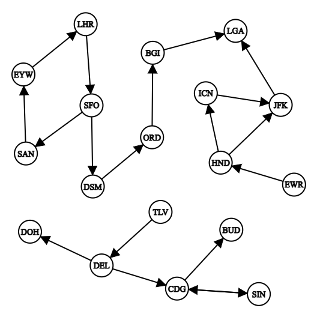

**Algorithm:** Kosaraju's Algorithm for Strongly Connected Components (SCC)

---

## **Exercise Statement**

You are given a list of **airports** and a list of **one-way routes** between them.  
The goal is to determine the **minimum number of new partnerships** a given airport must form to ensure that any passenger starting from this airport can reach **all other airports**.

**Tasks:**

1. Identify **Strongly Connected Components (SCCs)** in the airport network.
2. Build a **Directed Acyclic Graph (DAG)** of SCCs.
3. Determine the **source SCCs** that need direct partnerships from the starting airport.
4. Output the **minimum number of additional partnerships** required and the **airports to partner with**.

---

## **Definition of Kosaraju's Algorithm**

**Kosaraju's Algorithm** is a method used to find **Strongly Connected Components (SCCs)** in a directed graph.  
A **Strongly Connected Component** is a maximal subset of nodes such that **every node is reachable from every other node** in that subset.

**Steps of the algorithm:**

1. Perform a **DFS** on the original graph to compute a **finishing order** of nodes.
2. **Transpose the graph** by reversing all edges.
3. Perform DFS on the transposed graph in **decreasing order of finishing times**.  
   - Each DFS tree formed identifies a **Strongly Connected Component (SCC)**.

---

## **Why Kosaraju’s Algorithm is Optimal for This Problem**

- **Avoids brute-force**: Instead of checking all possible airport pairs (**O(n²)**), we:
  - Group airports that are **mutually reachable** (SCCs).
  - Focus only on SCCs with **no incoming edges** (sources) to determine necessary partnerships.
- **Efficiency**: Runs in **O(V + E)** time, where V = number of airports, E = number of routes.
- **Scalability**: Works efficiently for large airport networks, providing the exact minimum number of partnerships without unnecessary computations.

---

## **Approach Summary**

1. Compute SCCs using Kosaraju’s algorithm.
2. Build a DAG of SCCs to identify sources.
3. Determine the **minimum new partnerships** required by connecting the starting airport to each source SCC.
4. Output the **airports to partner with** and the **minimum number of partnerships**.

---

## **Example Graph**

The following image illustrates an example network of airports and routes:

  

- Nodes represent **airports**.
- Arrows represent **one-way routes**.
- SCCs can be visualized as clusters of mutually reachable airports.
- Source SCCs are the ones with no incoming edges and need partnerships from the start airport.

---

## **References**

- [Kosaraju’s Algorithm - GeeksforGeeks](https://www.geeksforgeeks.org/strongly-connected-components/)
- [Directed Acyclic Graphs (DAGs)](https://en.wikipedia.org/wiki/Directed_acyclic_graph)
